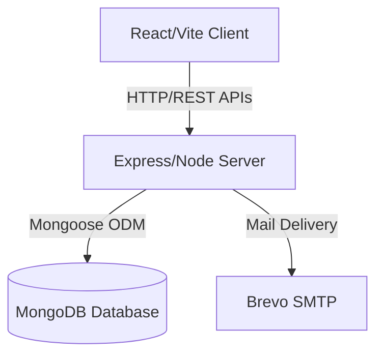

# FixNearby Development & Architecture Guide

Welcome to the contributor documentation for **FixNearby**! This guide details the development setup, repository structure, and codebase architecture.

---

## 🏗️ Architecture Overview

The system is structured as a classic decoupled client-server architecture:



### Directory Structure

```text
├── client/          # React frontend with Vite & Tailwind CSS
│   ├── src/
│   │   ├── components/  # Reusable UI components
│   │   ├── context/     # React state providers
│   │   ├── pages/       # Route pages
│   │   └── services/    # API calling client layers
├── server/          # Express API server
│   ├── config/      # DB and env configurations
│   ├── controllers/ # Route logic controllers
│   ├── middleware/  # Auth, rate limiting & upload helpers
│   ├── models/      # MongoDB Schema models
│   └── routes/      # REST API route paths
```

---

## 🚀 Getting Started

### Prerequisites

- **Node.js**: v18.x or higher
- **MongoDB**: Local community instance or MongoDB Atlas URI

### Local Installation

1. **Clone the repository**:
   ```bash
   git clone https://github.com/KGFCH2/FixNearby.git
   cd FixNearby
   ```

2. **Configure environment variables**:
   Create a `.env` file in the root directory (based on `.env.example`).
   ```env
   PORT=5000
   MONGODB_URI=mongodb://localhost:27017/FixNearby
   JWT_SECRET=your-secure-jwt-secret-key
   ```

3. **Install dependencies and start development servers**:
   * **Backend**:
     ```bash
     cd server
     npm install
     npm run dev
     ```
   * **Frontend**:
     ```bash
     cd client
     npm install
     npm run dev
     ```

### Running with Docker Compose

If you have Docker and Docker Compose installed, you can spin up the entire backend stack (MongoDB, Redis, Express API, and React client) with a single command from the root directory:

```bash
docker-compose up --build
```

This starts:
- **MongoDB** 7.0 on port `27017` with automatic health checks
- **Redis** 7-Alpine on port `6379` (required for BullMQ job queues and caching)
- **Express API** server on port `5000` with live-reload via mounted volumes
- **React/Vite** client on port `5173` with HMR

#### Docker Development Workflow

The development Docker Compose configuration uses:
- **Bind mounts**: Source code changes on the host are reflected inside containers immediately (no rebuild needed).
- **Dependency health checks**: Services wait for MongoDB and Redis to be ready before starting.
- **Multi-stage builds**: The `server/Dockerfile` uses separate stages for development and production.

Environment variables for Docker are sourced from your `.env` file or use safe defaults. Create a `.env` file in the root directory:

```env
JWT_SECRET=your-secure-jwt-secret-key
BREVO_API_KEY=your-brevo-api-key
BREVO_SENDER_NAME=FixNearby
BREVO_SENDER_EMAIL=noreply@fixnearby.com
```

To tear down the environment and remove volumes:
```bash
docker-compose down -v
```

#### Production Build

For production deployment, target the production stage:

```bash
docker build -t fixnearby-server:latest --target production ./server
docker build -t fixnearby-client:latest --target production ./client
```

---

## 🛡️ Coding Standards

- **Code Quality**: Ensure linting passes check prior to submitting any PRs (`npm run lint` inside the client folder).
- **Security**: Never commit raw API secrets or JWT passwords to git. Always use environment configs.
- **Git Flow**: Create isolated, focused branches for all changes. Propose an issue first.
